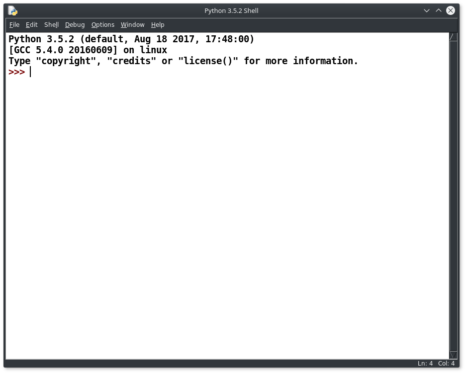

=================================
First Steps in Python Programming
=================================

Hello world!
------------

Whenever a programmer installs a new programming environment, the first thing they tend to do is to run some very simple
code to make sure everything is working as expected. Normally this is referred to as a **Hello World** program, as the
usual thing to do is to begin with some code to make the program output the phrase "Hello World" in some way. We are
going to do this using the built in Python environment known as IDLE. How you start this running, varies from machine to
machine, but it probably involves something like the start menu on Windows. Find the entry for python and look for one
that says Python(GUI) or IDLE(Python GUI) or something similar. Click on it, and you should find an application starts
up, that looks something like this:

IDLE on first startup

This is the interactive shell that Python shows when we first fire it up. You should be able to see, the version of
Python to which it is attached, on some systems it is essential that you make sure you're using the correct version of
Python as there may be multiple editions installed. Normally we are going to want version 3 of python this will have a 3
followed by two numbers separated by full stops. The latest version at the time of writing is 3.6.2, but any version
after about 3.2 should be reasonably up to date.

The Python shell is an interactive terminal, this means we can type in individual Python commands and see the results in
the shell, straight away (in Computer Science terms it is a REPL, which stands for Read-Evaluate-Print-Loop, but Python
uses the term shell, so we'll stick with that). Occasionally we may want to check the syntax of a Python command, and we
can do this here in the shell, but normally we want to write code that will be saved in a file, between uses, and then
run when needed. To do this we need to click on the **File** menu in IDLE, and choose the first entry, this normally
says either **New Window** or **New File** depending on the version of Python you are using and the operating System you
are using it on. Clicking on this option will open up a blank editor window, which is where we want to type our code:

A blank editor window waiting for your code.

We are going to enter the simplest of code into our editor window, save it and run it. You can also run the code just in
the browser, using the Active Code area below.

.. activecode:: hello_world_01
   :nocanvas:
   :caption: The Hello World Program
   :language: python

   print("Hello world!")

Once you're happy with what the code will do, enter it into the editor window in IDLE so that it looks like this:

The code in the editor, waiting to be run

Go to the **Run** menu and select **Run module** or press F5 without selecting the menu first. This will ask you to save
the Source Code (Source Code is the term used to describe the code that a programmer enters, this is then interpreted by
Python into something the computer will understand), click Okay, give the file a sensible name and save it in a sensible
place (ie where you can find it again) and then look at the output in the shell. On some operating systems the window
containing the Python shell will automatically grab focus, and pop to the front, on others you will have to search for
it. You should see something resembling this:

The results of running our code, as it will display in the Python shell

From now on, you can run any of the code from these tutorials in IDLE and it should work, but we will be focusing purely
on looking at the code, using the browser and the Active Code section. If you are using IDLE, unless otherwise stated,
the code needs to be entered in an Editor window and saved, in order for it to run. Hitting F5 will automatically ask
you if you want to save the code before running it, the results (if any) will usually be displayed in the shell.

   
   

